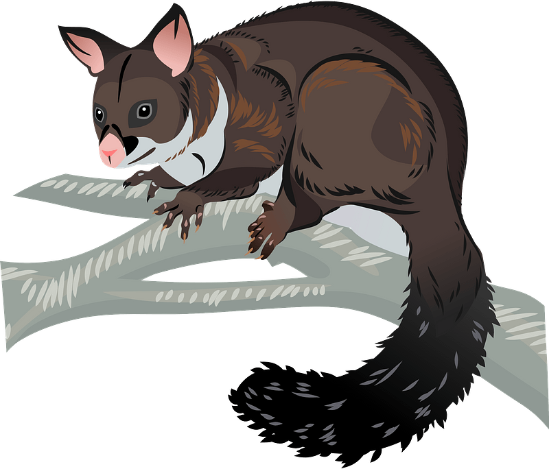

<div align="right"><b>Programming Possum<b></div>
<div align="right"></img></div>
<br/><br/>
    
# Hello World

### Python
```python
#My first program
print("Hello World")
```

### Java
```java
//My first program
class HelloWorld {
    public static void main(String[] args) {
        System.out.println("Hello World\n"); 
    }
}
```

### C
```c
#include <stdio.h>

//My first program
int main(int argc, char** argv) {
    printf("Hello World\n");
    return 0;
}
```

### MATLAB
```matlab
%My first program
disp("Hello World\n")
fprintf("Hello World\n")
```

### Octave
```octave
%My first program
#My first program
disp("Hello World\n")
fprintf("Hello World\n")
```

### R
```r
#My first program
print("Hello World\n")
cat("Hello World\n")
```

### Javascript
```javascript
alert("Hello, World!");
console.log("Hello World\n");
```

---
<sub><sup><a href="https://creazilla.com/nodes/64027-brushtail-possum-clipart">“Brushtail Possum clipart”</a>, by <a href="https://creazilla.com/">Creazilla</a>, licensed under <a href="https://creativecommons.org/licenses/by/4.0/">CC BY 4.0</a></sup></sub>
